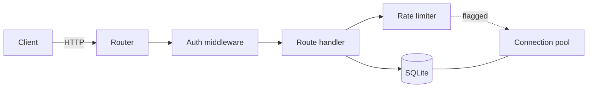

# Architecture

How a request flows through **acme-api** — and where the audit found issues.

- **Auth middleware** runs before every handler.
- The **rate limiter** and **connection pool** are the two areas flagged in the current audit (see `notes.txt`).
